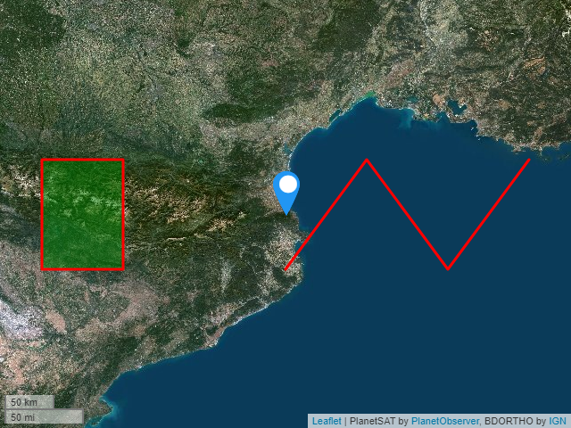

# kapture

[](https://app.travis-ci.com/kalisio/kapture)

**Capture Kano Snapshots as a Service**

**kapture** is a lightweight service that let you take screenshots of [Kano](https://kalisio.github.io/kano/). 

**kapture** relies on [Puppeteer](https://github.com/puppeteer/puppeteer) and [Express](https://expressjs.com/fr/)

## API

### capture (POST)

Request a capture with the following query parameters.

The body of the request must conform the [GeoJSON specification](https://datatracker.ietf.org/doc/html/rfc7946). But **kapture** supports only the following properties:

| Property | Description |
| --- | --- |
| `features` | specifies the array of features to be rendered over the map. |
| `bbox` | speifies the capture spatial extension. |

On the other hand **kapture** handles additional properties:

| Property | Description |
| --- | --- |
| `layer` | specifies the base layer to render | 
| `size` | specifies the capture size. | 

The `layer` property must confomr the following JSON schema: 

```json
"baseLayer": {
  "type": "string"
}
```

The `size` property must confor the following JSON schema: 

```json
"size": {
  "type": "object",
  "properties": {
    "width": {
      "type": "integer",
      "default": 1024
    },
    "height": {
      "type": "integer",
      "default": 768
    }
}
```

Here is a complete sample:

```json
{
    "layer": "IMAGERY",
    "features": [
        { 
            "type": "Feature",
            "geometry": {
                "type": "Point", 
                "coordinates": [3, 42.5]
            },
            "properties": {"prop0": "value0"}
        },
        { 
            "type": "Feature",
            "geometry": {
                "type": "LineString",
                "coordinates": [
                    [3, 42], [4, 43], [5,42], [6, 43]
                ]
            },
            "properties": {
                "prop0": "value0",
                "prop1": 0.0
            }
        },
        { 
            "type": "Feature",
            "geometry": {
                "type": "Polygon",
                "coordinates": [
                    [ [0, 42], [1, 42], [1, 43], [0, 43], [0, 42] ]
                ]
            },
            "properties": {
                "prop0": "value0",
                "prop1": {"this": "that"}
            }
        }
    ],
    "size": {
      "width": 800,
      "heigh": 600
    }
}
```

And the response looks like:



### healthcheck (GET)

Check for the health of the service

## Configuring

Here are the environment variables you can use to customize the service:

| Variable  | Description | Defaults |
|-----------| ------------| ------------|
| `KANO_URL` | The **Kano** url | - |
| `KANO_JWT` | The **Kano** token to get connected | * |

## Building

### Manual build 

You can build the image with the following command:

```bash
docker build -t <your-image-name> .
```

### Automatic build using Travis CI

This project is configured to use **Travis** to build and push the image on the [Kalisio's Docker Hub](https://hub.docker.com/u/kalisio/).
The built image is tagged using the `version` property in the `package.json` file.

To enable Travis to do the job, you must define the following variable in the corresponding Travis project:

| Variable  | Description |
|-----------| ------------|
| `DOCKER_USER` | your username |
| `DOCKER_PASSWORD` | your password |

## Deploying

This image is designed to be deployed using the [Kargo](https://kalisio.github.io/kargo/) project.

Check out the [compose file](https://github.com/kalisio/kargo/blob/master/deploy/kontrol.yml) to have an overview on how the container is deployed.

## Contributing

Please read the [Contributing file](./.github/CONTRIBUTING.md) for details on our code of conduct, and the process for submitting pull requests to us.

## Authors

This project is sponsored by 


## License

This project is licensed under the MIT License - see the [license file](./LICENSE.md) for details